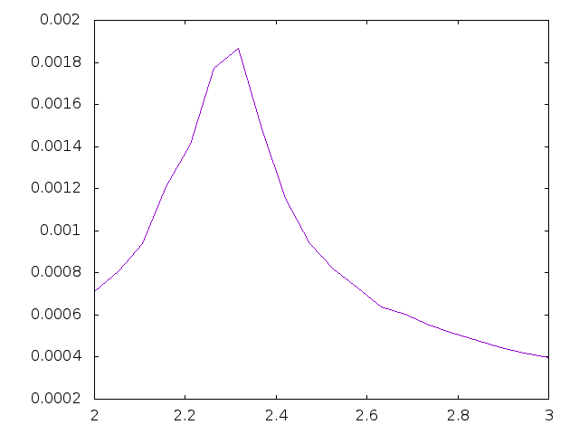

# Midterm 2

  Dennis Scheglov, Joshua Pelton
  This program was designed to use the Ising Model to determine the temperature of phase transitions for a two-dimensional   triangular lattice. Initially given the code for a square lattice, we modified the original to accomodate the new dimensions, in which 6 neighbors are present rather than 4.

Calculating interaction energy between nearest neighbors for each spin within the lattice was done with a metropolis simulation. Each temperature, a Boltzmann ratio was generated, used as the probability that a spin change that increases temperature can be accepted. Initial conditions were such that spins began "randomly" distributed. A GSL random number generator simulated the inherent randomness of the model.

To determine the temperature of the phase transitions, we ran the metropolis simulation for several different temperatures. Specific heat is calculated for several steps, and is then plotted against temperature. Phase transition corresponds to the specific heat of the material. The graph for this information is below.

Special thanks to Filip Bergabo for his help.
